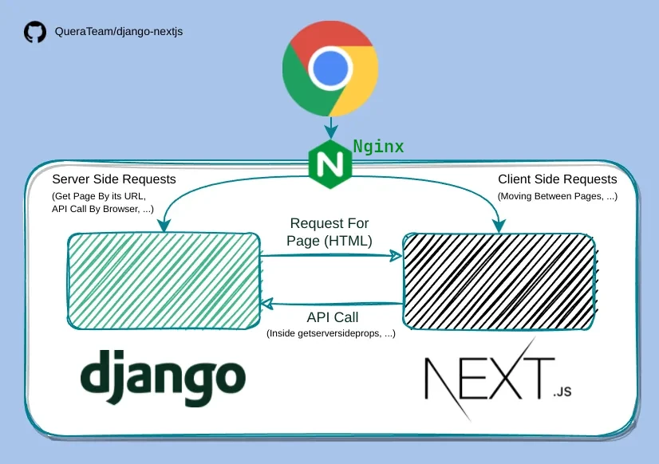

# Django-Next.js

[](https://pypi.python.org/pypi/django-nextjs/)
[](https://github.com/QueraTeam/django-nextjs/actions)
[](https://github.com/QueraTeam/django-nextjs/blob/master/LICENSE)
[](https://github.com/psf/black)

Integrate Next.js into your Django project,
allowing Django and Next.js pages to work together seamlessly.

## Is this package right for you?

django-nextjs is designed for projects
that need both Django pages (usually rendered by Django templates) and Next.js pages. Some scenarios:

- You want to add some Next.js pages to an existing Django project.
- You want to migrate your frontend to Next.js, but since the project is large, you want to do it gradually.

If this sounds like you, **this package is the perfect fit**. ✅

However, if you’re starting a new project and intend to use Django purely as an API backend with Next.js as a standalone frontend, you **don’t need** this package.
Simply run both servers and configure your public web server to point to Next.js for a straightforward setup.

## How does it work?

When a user opens a page, django receives the initial request, queries the Next.js server for the HTML response, and returns it to the user.
After opening a Next.js page, the user can navigate to other Next.js pages without any additional requests to Django (the Next.js server handles the routing).

This is how it looks like in production:



In development, to simplify the setup and remove the need to a reverse proxy like Nginx, Django also acts as the reverse proxy for Next.js client-side requests.

## Getting Started

- Install the latest version from PyPI.

  ```shell
  pip install django-nextjs
  ```

- Add `django_nextjs.apps.DjangoNextJSConfig` to `INSTALLED_APPS`.

- Set up Next.js URLs depending on your environment.

## Setup Next.js URLs (Development Environment)

If you're serving your site under ASGI during development,
use [Django Channels](https://channels.readthedocs.io/en/stable/) and
add `NextJSProxyHttpConsumer`, `NextJSProxyWebsocketConsumer` to `asgi.py` like the following example.

**Note:** We recommend using ASGI and Django Channels,
because it is required for [fast refresh](https://nextjs.org/docs/architecture/fast-refresh) (hot module replacement) to work properly in Nextjs 12+.

```python
import os

from django.core.asgi import get_asgi_application
from django.urls import re_path, path

os.environ.setdefault("DJANGO_SETTINGS_MODULE", "myproject.settings")
django_asgi_app = get_asgi_application()

from channels.auth import AuthMiddlewareStack
from channels.routing import ProtocolTypeRouter, URLRouter
from django_nextjs.proxy import NextJSProxyHttpConsumer, NextJSProxyWebsocketConsumer

from django.conf import settings

# put your custom routes here if you need
http_routes = [re_path(r"", django_asgi_app)]
websocket_routers = []

if settings.DEBUG:
    http_routes.insert(0, re_path(r"^(?:_next|__next|next).*", NextJSProxyHttpConsumer.as_asgi()))
    websocket_routers.insert(0, path("_next/webpack-hmr", NextJSProxyWebsocketConsumer.as_asgi()))


application = ProtocolTypeRouter(
    {
        # Django's ASGI application to handle traditional HTTP and websocket requests.
        "http": URLRouter(http_routes),
        "websocket": AuthMiddlewareStack(URLRouter(websocket_routers)),
        # ...
    }
)
```

Otherwise (if serving under WSGI during development), add the following to the beginning of `urls.py`:

```python
path("", include("django_nextjs.urls"))
```

**Warning:** If you are serving under ASGI, do NOT add this
to your `urls.py`. It may cause deadlocks.

## Setup Next.js URLs (Production Environment)

In production, use a reverse proxy like Nginx or Caddy:

| URL                 | Action                                     |
| ------------------- | ------------------------------------------ |
| `/_next/static/...` | Serve `NEXTJS_PATH/.next/static` directory |
| `/_next/...`        | Proxy to `http://localhost:3000`           |
| `/next/...`         | Serve `NEXTJS_PATH/public/next` directory  |

Example config for Nginx:

```conf
location /_next/static/ {
    alias NEXTJS_PATH/.next/static/;
    expires max;
    add_header Cache-Control "public";
}
location /_next/ {
    proxy_pass  http://127.0.0.1:3000;
    proxy_set_header Host $http_host;
    proxy_set_header X-Real-IP $remote_addr;
    proxy_set_header X-Forwarded-For $proxy_add_x_forwarded_for;
    proxy_set_header X-Forwarded-Proto $scheme;
}
location /next/ {
    alias NEXTJS_PATH/public/next/;
    expires max;
    add_header Cache-Control "public";
}
```

## Usage

Start Next.js server:

```shell
# Development:
$ npm run dev

# Production:
$ npm run build
$ npm run start
```

Start by developing your pages in Next.js, Then define a Django URL for each Next.js page. Here's an example of how you can do this:

```python
from django_nextjs.views import nextjs_page

urlpatterns = [
    path("/nextjs/page", nextjs_page(), name="nextjs_page"),
]
```

Even though it's not recommended, sometimes you might need to add some custom steps before showing a Next.js page in Django. However, **we advise moving this logic to Next.js to ensure it's applied even during client-side navigation**. If you find yourself in this situation, you can create an asynchronous view for each page as demonstrated below:

```python
from django_nextjs.render import render_nextjs_page

async def jobs(request):
    # Your custom logic
    return await render_nextjs_page(request)
```

#### Using `nextjs_page` with `stream=True` (Recommended)

If you're using the [Next.js App Router](https://nextjs.org/docs/app) (introduced in Next.js 13+), you can enable streaming by setting the `stream=True` parameter in the `nextjs_page` function. This allows the HTML response to be streamed directly from the Next.js server to the client. This approach is particularly useful for server-side rendering with streaming support to show an [instant loading state](https://nextjs.org/docs/app/building-your-application/routing/loading-ui-and-streaming#instant-loading-states) from the Next.js server while the content of a route segment loads.

Here's an example:

```python
from django_nextjs.views import nextjs_page

urlpatterns = [
  path("/nextjs/page", nextjs_page(stream=True), name="nextjs_page"),
]
```

**Considerations:**

- When using `stream_nextjs_page`, you cannot use a custom HTML template in Django, as the HTML is streamed directly from the Next.js server.
- The `stream` parameter is currently set to `False` by default for backward compatibility. However, in future releases, it will be set to `True` by default. We recommend updating your code to explicitly enable streaming to prepare for this change.

## Customizing the HTML Response

You can modify the HTML code that Next.js returns in your Django code.

Avoiding duplicate code for the navbar and footer is a common use case
for this if you are using both Next.js and Django templates.
Without it, you would have to write and maintain two separate versions
of your navbar and footer (a Django template version and a Next.js version).
However, you can simply create a Django template for your navbar and insert its code
at the beginning of `<body>` tag returned from Next.js.

To enable this feature, you need to customize the document and root layout
in Next.js and make the following adjustments:

- Add `id="__django_nextjs_body"` as the first attribute of `<body>` element.
- Add `<div id="__django_nextjs_body_begin" />` as the first element inside `<body>`.
- Add `<div id="__django_nextjs_body_end" />` as the last element inside `<body>`.

NOTE: Currently HTML customization is not working with [app router](https://nextjs.org/docs/app) (Next.js 13+).

Read
[this doc](https://nextjs.org/docs/pages/building-your-application/routing/custom-document)
and customize your Next.js document:

```jsx
// pages/_document.jsx (or .tsx)
...
<body id="__django_nextjs_body">
  <div id="__django_nextjs_body_begin" />
  <Main />
  <NextScript />
  <div id="__django_nextjs_body_end" />
</body>
...
```

<!-- If you are using Next.js 13+, you also need to
[customize the root layout](https://nextjs.org/docs/app/api-reference/file-conventions/layout)
in `app` directory:

```jsx
// app/layout.jsx (or .tsx)
...
<body id="__django_nextjs_body" className={inter.className}>
  <div id="__django_nextjs_body_begin" />
  {children}
  <div id="__django_nextjs_body_end" />
</body>
...
``` -->

Write a Django template that extends `django_nextjs/document_base.html`:

```django




  <!-- ... the content you want to place at the beginning of "head" tag ... -->
  {{ block.super }}
  <!-- ... the content you want to place at the end of "head" tag ... -->




  ... the content you want to place at the beginning of "body" tag ...
  ... e.g. include the navbar template ...
  {{ block.super }}
  ... the content you want to place at the end of "body" tag ...
  ... e.g. include the footer template ...

```

Pass the template name to `nextjs_page` or `render_nextjs_page`:

```python
from django_nextjs.render import render_nextjs_page
from django_nextjs.views import nextjs_page

async def jobs(request):
    return await render_nextjs_page(request, template_name="path/to/template.html")

urlpatterns = [
    path("/nextjs/page", nextjs_page(template_name="path/to/template.html"), name="nextjs_page"),
    path("/jobs", jobs, name="jobs_page")
]

```

## Notes

- If you want to add a file to `public` directory of Next.js,
  that file should be in `public/next` subdirectory to work correctly.
- If you're using Django channels, make sure all your middlewares are
  [async-capable](https://docs.djangoproject.com/en/dev/topics/http/middleware/#asynchronous-support).
- To avoid "Too many redirects" error, you may need to add `APPEND_SLASH = False` in your Django project's `settings.py`. Also, do not add `/` at the end of nextjs paths in `urls.py`.
- This package does not provide a solution for passing data from Django to Next.js. The Django Rest Framework, GraphQL, or similar solutions should still be used.
- The Next.js server will not be run by this package. You will need to run it yourself.

## Settings

Default settings:

```python
NEXTJS_SETTINGS = {
    "nextjs_server_url": "http://127.0.0.1:3000",
    "ensure_csrf_token": True,
}
```

### `nextjs_server_url`

The URL of Next.js server (started by `npm run dev` or `npm run start`)

### `ensure_csrf_token`

If the user does not have a CSRF token, ensure that one is generated and included in the initial request to the Next.js server by calling Django's `django.middleware.csrf.get_token`. If `django.middleware.csrf.CsrfViewMiddleware` is installed, the initial response will include a `Set-Cookie` header to persist the CSRF token value on the client. This behavior is enabled by default.

**When you need `ensure_csrf_token`?**

You may need to issue GraphQL POST requests to fetch data in Next.js `getServerSideProps`. If this is the user's first request, there will be no CSRF cookie, causing the request to fail since GraphQL uses POST even for data fetching.
In this case this option solves the issue,
and as long as `getServerSideProps` functions are side-effect free (i.e., they don't use HTTP unsafe methods or GraphQL mutations), it should be fine from a security perspective. Read more [here](https://docs.djangoproject.com/en/3.2/ref/csrf/#is-posting-an-arbitrary-csrf-token-pair-cookie-and-post-data-a-vulnerability).

## Contributing

To start development:

- Install development dependencies in your virtualenv with `pip install -e '.[dev]'`
- Install pre-commit hooks using `pre-commit install`.

Love django-next.js? 🌟 Star us on GitHub to help the project grow!

## License

MIT
